# emp3r0r
linux post-exploitation framework made by linux user

----------

ARCHIVED, this file won't be updated, please check [README](./README.md)

----------

## table of contents

<!-- vim-markdown-toc GFM -->

* [what does it do](#what-does-it-do)
    * [core features](#core-features)
        * [transports](#transports)
        * [auto proxy for agents without direct internet access](#auto-proxy-for-agents-without-direct-internet-access)
        * [anti-antivirus (or anti-whateveryoucallthem)](#anti-antivirus-or-anti-whateveryoucallthem)
        * [agent traffic](#agent-traffic)
        * [packer - start agent in memory](#packer---start-agent-in-memory)
        * [dropper - pure memory based agent launching](#dropper---pure-memory-based-agent-launching)
        * [hide processes and files](#hide-processes-and-files)
        * [persistence](#persistence)
    * [modules](#modules)
        * [reverse proxy](#reverse-proxy)
        * [shellcode injection](#shellcode-injection)
        * [shellcode loader](#shellcode-loader)
        * [basic command shell](#basic-command-shell)
        * [ssh to any kind of shells you like!](#ssh-to-any-kind-of-shells-you-like)
        * [credential harvesting](#credential-harvesting)
        * [auto root](#auto-root)
        * [LPE suggest](#lpe-suggest)
        * [port mapping](#port-mapping)
        * [reverse port mapping (interoperability with other frameworks)](#reverse-port-mapping-interoperability-with-other-frameworks)
        * [plugin system](#plugin-system)
* [thanks](#thanks)

<!-- vim-markdown-toc -->

## what does it do

### core features

#### transports

emp3r0r utilizes [HTTP2](https://github.com/posener/h2conn) (TLS enabled) for its CC communication, but you can also encapsulate it in other transports such as [TOR](https://github.com/jm33-m0/emp3r0r/wiki/Getting-started#tor), and [CDNs](https://github.com/jm33-m0/emp3r0r/wiki/Getting-started#cdn). all you need to do is [tell emp3r0r agent to use your proxy](https://github.com/jm33-m0/emp3r0r/wiki/Getting-started#tor-1)

also, emp3r0r has its own CA pool, agents trusts only emp3r0r's own CA (which you can [generate](https://github.com/jm33-m0/emp3r0r/wiki/Getting-started#build-cc) using `build.py`), making MITM attack much harder

below is a screenshot of emp3r0r's CC server, which has 3 agent coming from 3 different transports

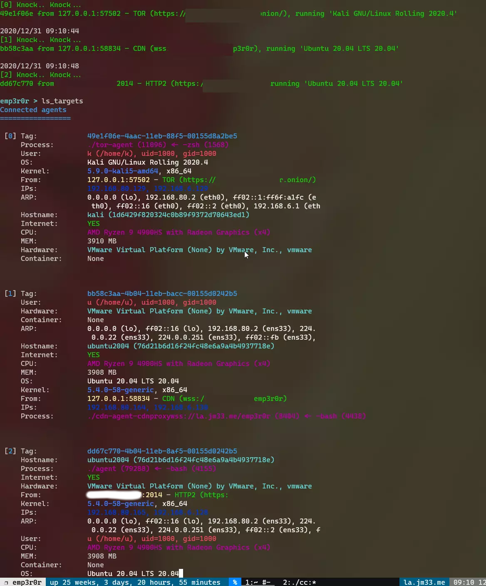

#### auto proxy for agents without direct internet access

emp3r0r agents check if they have internet access on start, and start a socks5 proxy if they do, then they broadcast their proxy addresses (in encrypted form) on each network they can reach

if an agent doesn't have internet, its going to listen for such broadcasts. when it receives a working proxy, it starts a port mapping of that proxy and broadcasts it to its own networks, bringing the proxy to every agent it can ever touch, and eventually bring all agents to our CC server.

in the following example, we have 3 agents, among which only one (`[1]`) has internet access, and `[0]` has to use the proxy passed by `[2]`

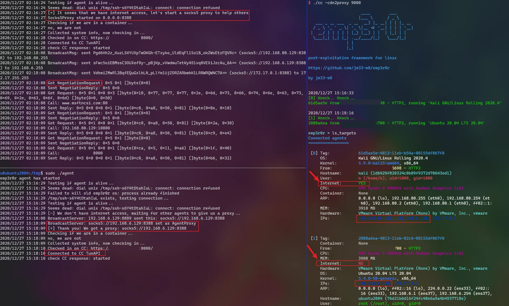

#### anti-antivirus (or anti-whateveryoucallthem)

- a cryptor that loads agent into memory
- shellcode dropper
- everything is randomized
- one agent build for each target

#### agent traffic

every time an agent starts, it checks a preset URL for CC status, if it knows CC is offline, no further action will be executed, it waits for CC to go online

you can set the URL to a GitHub page or other less suspicious sites, your agents will poll that URL every random minutes

no CC communication will happen when the agent thinks CC is offline

if it isnt:

bare HTTP2 traffic:

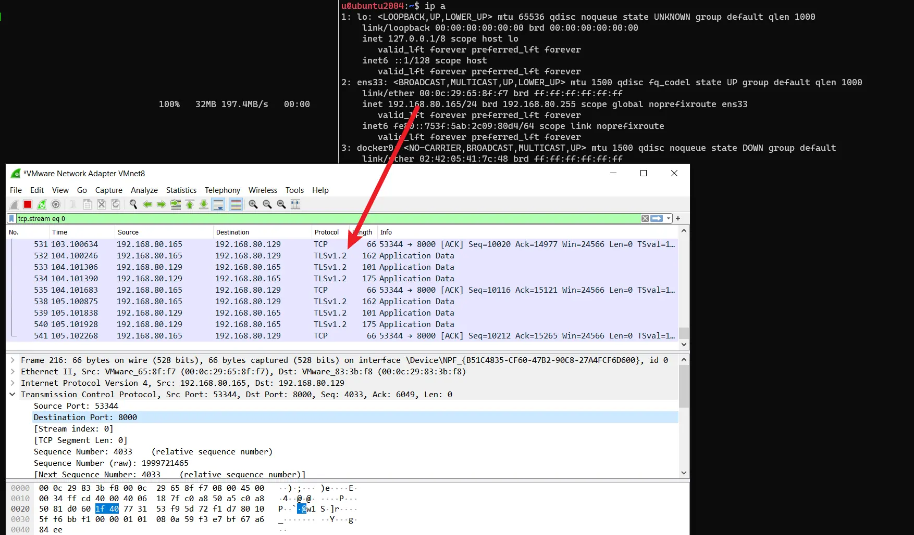

when using Cloudflare CDN as CC frontend:

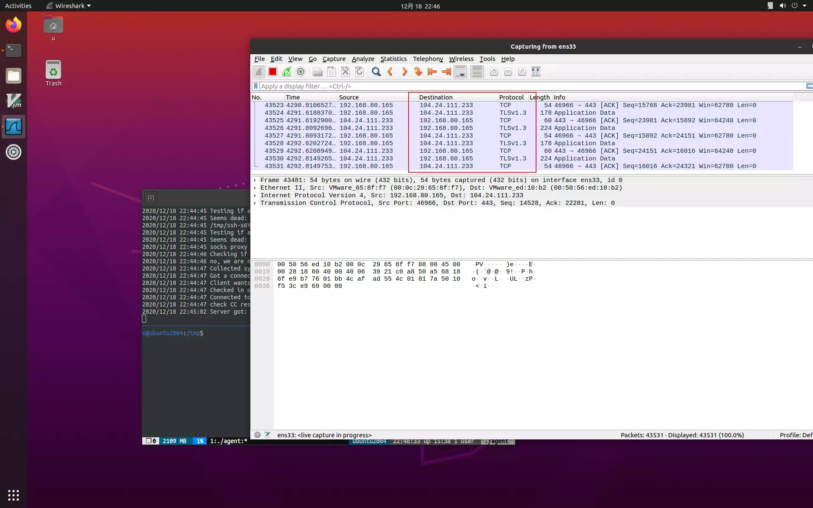

#### packer - start agent in memory

[packer](https://github.com/jm33-m0/emp3r0r/wiki/Packer) encrypts `agent` binary, and runs it from memory (using `memfd_create`)

currently emp3r0r is mostly memory-based, if used with this packer

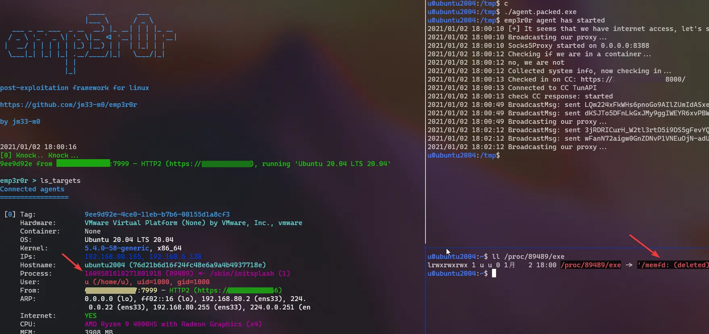

#### dropper - pure memory based agent launching

[dropper](https://github.com/jm33-m0/emp3r0r/wiki/Dropper) drops a shellcode or script on your target, eventually runs your agent, in a stealth way

below is a screenshot of a python based shellcode delivery to agent execution:

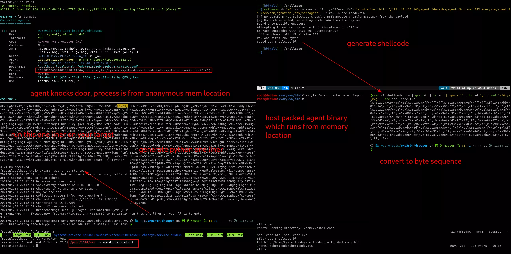

#### hide processes and files

currently emp3r0r uses [libemp3r0r](https://github.com/jm33-m0/emp3r0r/tree/master/libemp3r0r) to hide its files and processes, which utilizes glibc hijacking

#### persistence

currently implemented methods:

- [shellcode injection](#shellcode-injection)
- [libemp3r0r](https://github.com/jm33-m0/emp3r0r/tree/master/libemp3r0r)
- cron
- bash profile and command injection

more will be added in the future

### modules

#### reverse proxy

think it as `ssh -R`, when autoproxy module doesn't work because of the **firewall** on the agent that provides proxy service, what can you do?

in normal circumstances, we would use `ssh -R` to map our client-side port to the ssh server, so the server can connect to us to share our internet connection.

thats exactly what emp3r0r does, except it doesn't require any openssh binaries to be installed, type `use reverse_proxy` to get started!

with this feature you can bring **every host that you can reach** to emp3r0r CC server.

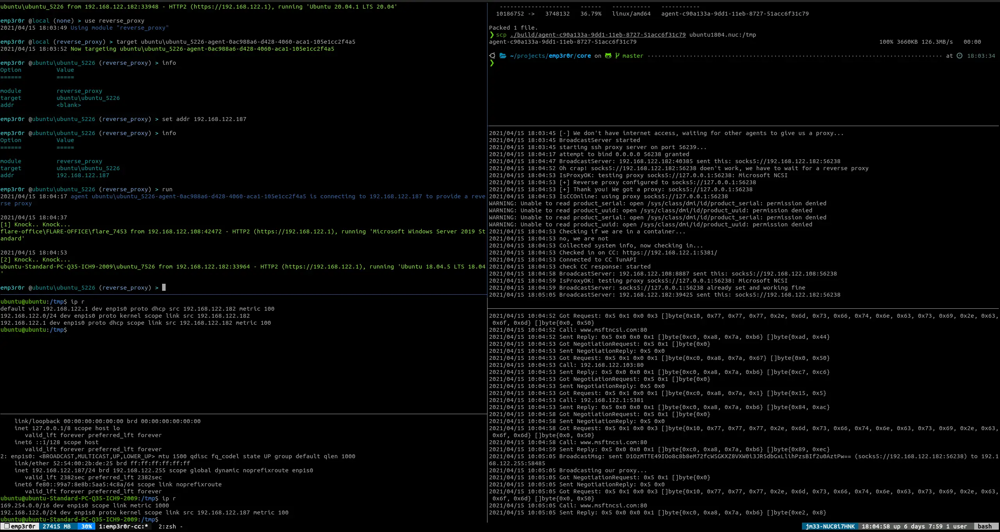

#### shellcode injection

inject guardian shellcode into arbitrary process, to gain persistence

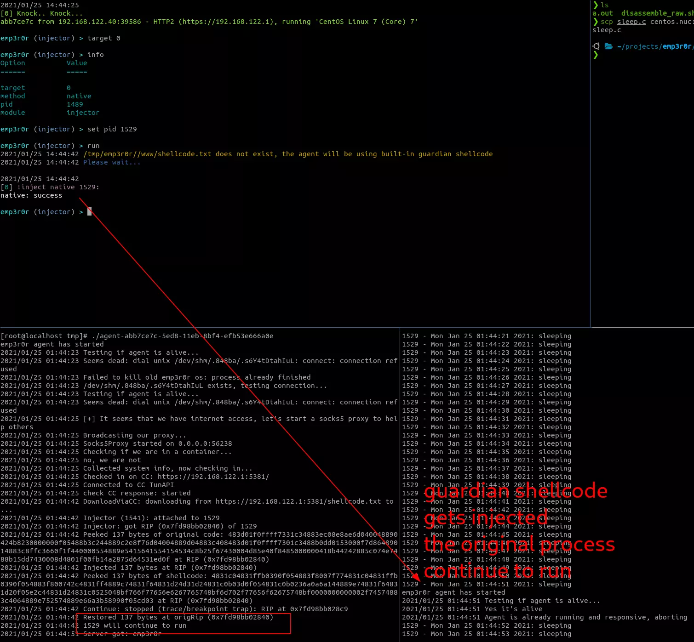

#### shellcode loader

this module helps you execute meterpreter or Cobalt Strike shellcode directly in emp3r0r's memory,
combined with [reverse_portfwd](#reverse-port-mapping-interoperability-with-other-frameworks),
you can use other post-exploitation frameworks right inside emp3r0r

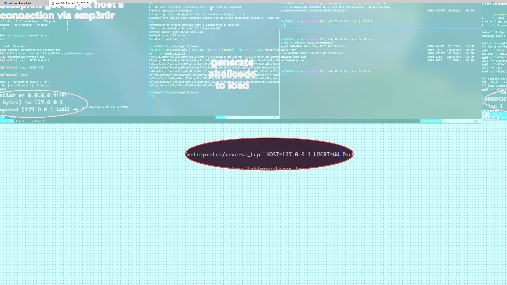

#### basic command shell

this is **not a shell**, it just executes any commands you send with `sh -c` and sends the result back to you

besides, it provides several useful helpers:

- file management: `put` and `get`
- command autocompletion
- `#net` shows basic network info, such as `ip a`, `ip r`, `ip neigh`
- `#kill` processes, and a simple `#ps`
- `bash` !!! this is the real bash shell, keep on reading!

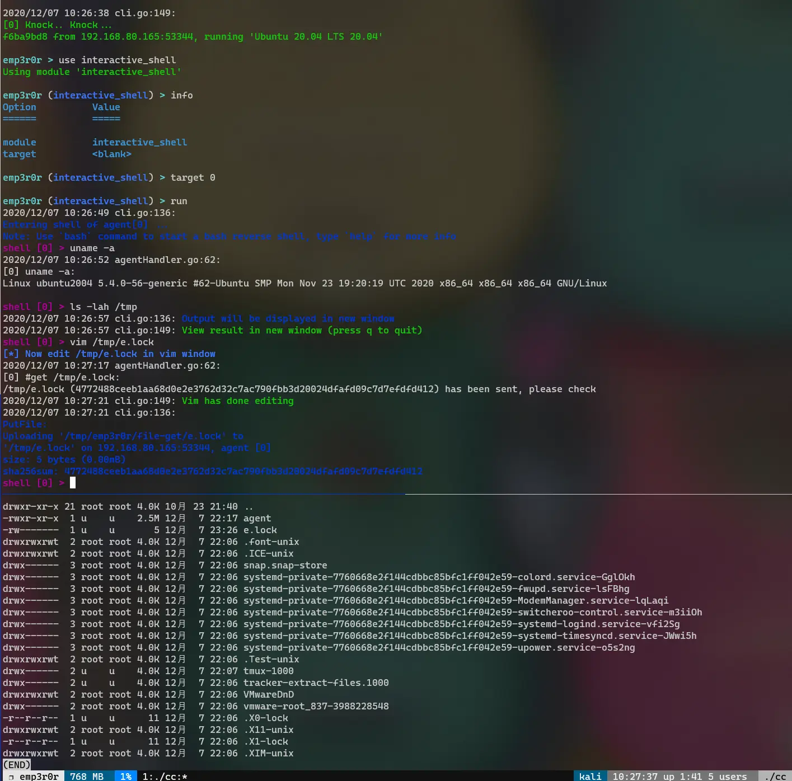

#### ssh to any kind of shells you like!

with module `interactive_shell`, you can set `shell` to normal `bash`, `sh`, `busybox`, or even `python` if you like!

all the shells works like you `ssh` to the host, for most cases, **PTY is fully enabled**

this is choosing a shell to `ssh` into, by default we are doing `bash`

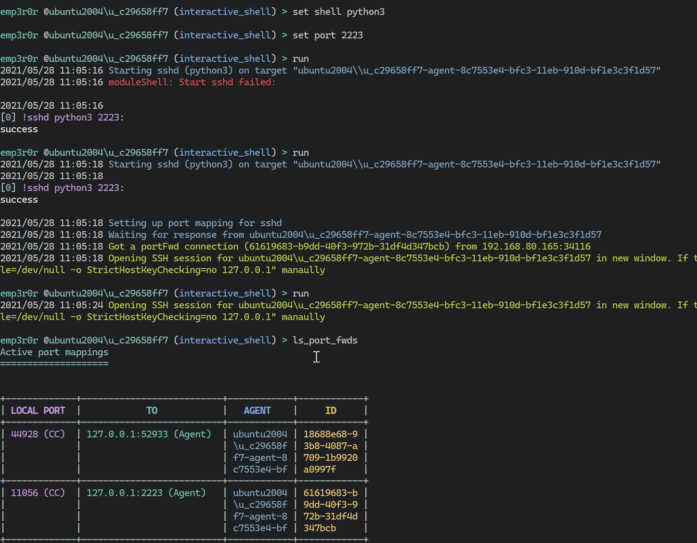

you can see the `bash` shell you just created in a new tmux window

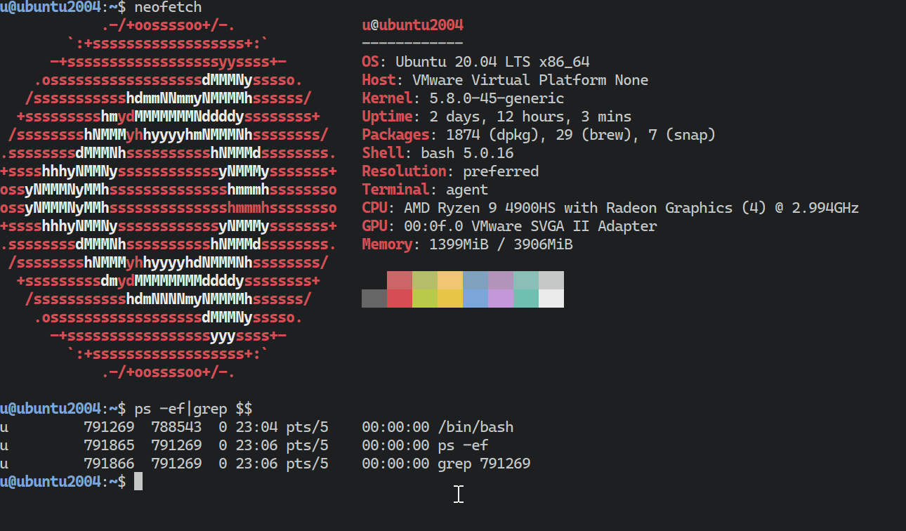

and `python`? you can `spaw('bash')` if you like

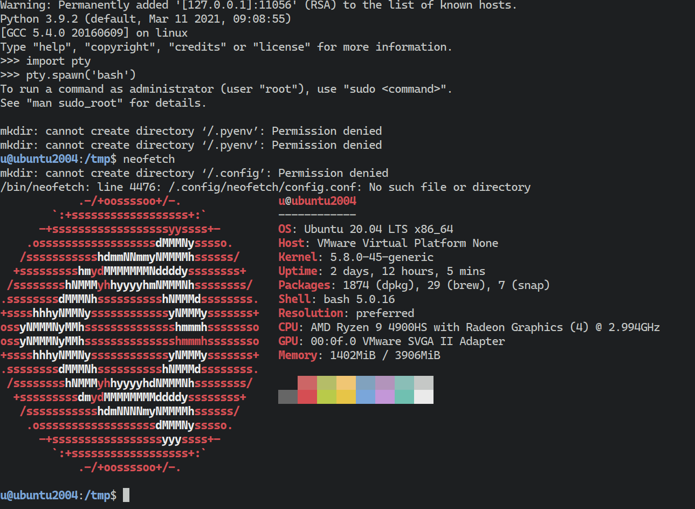

you can open **as many shells as you like**!

each shell has its own port mapping, allowing you to `ssh -p port localhost` directly.

with tmux you can see all of your shells organized cleanly in your current tmux session

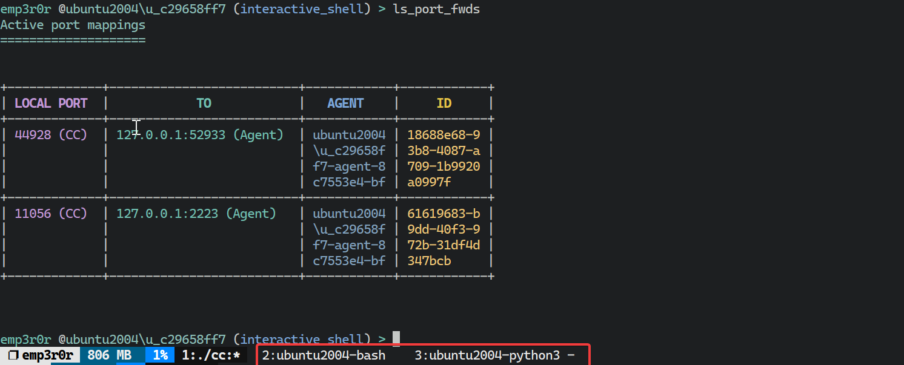

#### credential harvesting

not implemented yet

i wrote about this in my [blog](https://jm33.me/sshd-injection-and-password-harvesting.html)

#### auto root

currently emp3r0r supports [CVE-2018-14665](https://jm33.me/sshd-injection-and-password-harvesting.html), agents can exploit this vulnerability if possible, and restart itself with root privilege

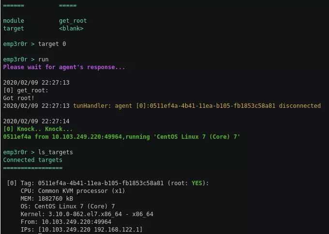

#### LPE suggest

upload the latest:

- [mzet-/linux-exploit-suggester](https://github.com/mzet-/linux-exploit-suggester)
- [pentestmonkey/unix-privesc-check](https://github.com/pentestmonkey/unix-privesc-check)

and run them on target system, return the results

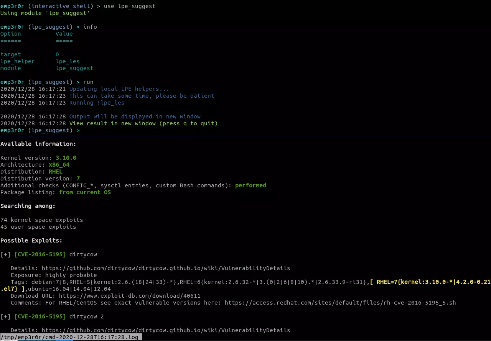

#### port mapping

map any target addresses to CC side, using HTTP2 (or whatever transport your agent uses)

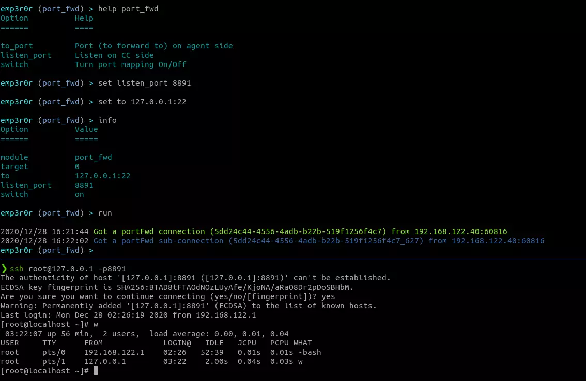

#### reverse port mapping (interoperability with other frameworks)

this screenshot shows a [meterpreter](https://www.offensive-security.com/metasploit-unleashed/meterpreter-basics/) session established with the help of `emp3r0r`

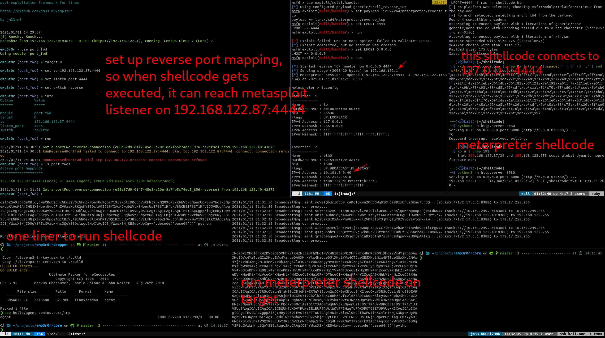

#### plugin system

yes, there is a plugin system. please read the [wiki](https://github.com/jm33-m0/emp3r0r/wiki/Plugins) for more information

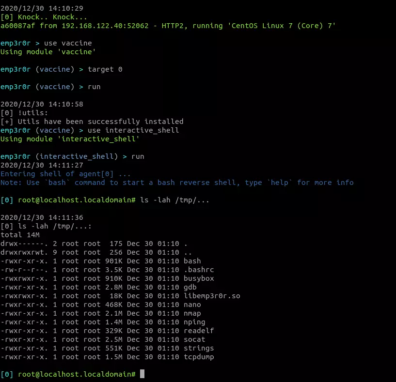

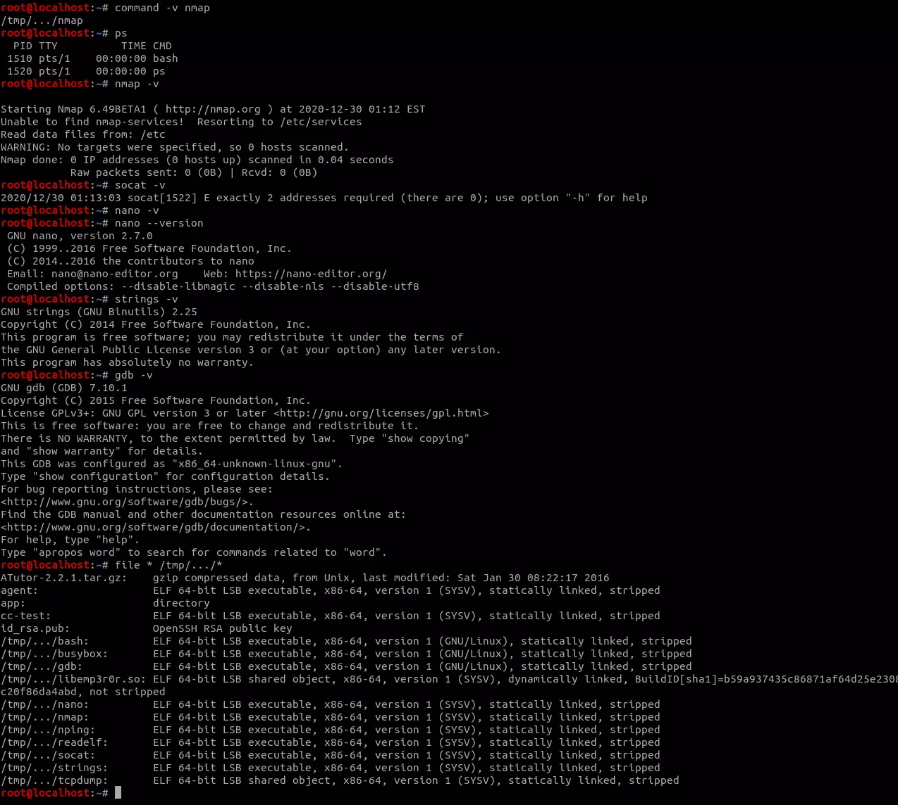

## thanks

- [pty](https://github.com/creack/pty)
- [guitmz](https://github.com/guitmz)
- [sektor7](https://blog.sektor7.net/#!res/2018/pure-in-memory-linux.md)
- [readline](https://github.com/bettercap/readline)
- [h2conn](https://github.com/posener/h2conn)
- [diamorphine](https://github.com/m0nad/Diamorphine)
- [Upgrading Simple Shells to Fully Interactive TTYs](https://blog.ropnop.com/upgrading-simple-shells-to-fully-interactive-ttys/)
- more can be found in [`go.mod`](./core/go.mod)
