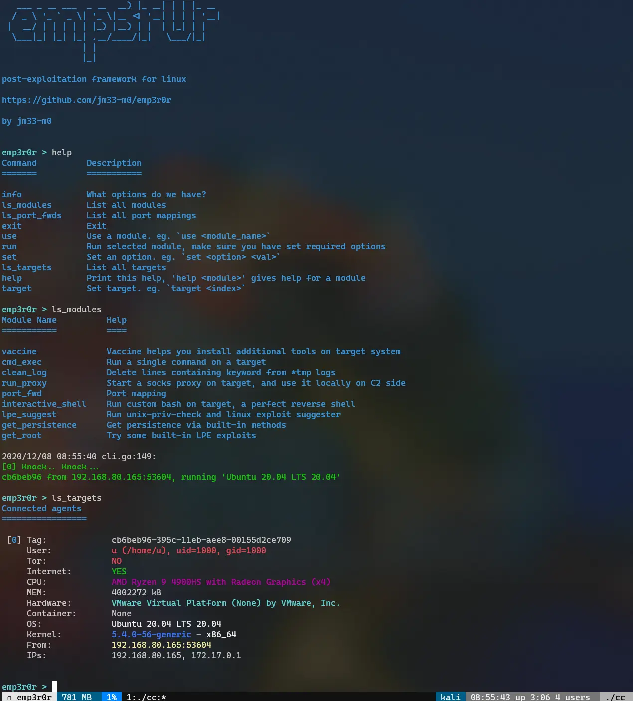

# emp3r0r
linux post-exploitation

**Still under active development**

<a href="https://www.freebuf.com/sectool/259079.html" target="_blank">中文介绍</a>

<!-- vim-markdown-toc GFM -->

* [updates](#updates)
* [features](#features)
* [screenshots](#screenshots)
    * [help and modules](#help-and-modules)
    * [agent info](#agent-info)
    * [auto proxy for agents without direct internet access](#auto-proxy-for-agents-without-direct-internet-access)
    * [basic command shell](#basic-command-shell)
    * [fully interactive and stealth bash shell](#fully-interactive-and-stealth-bash-shell)
    * [agent traffic](#agent-traffic)
* [how to test](#how-to-test)
* [thanks](#thanks)

<!-- vim-markdown-toc -->

## updates

<a href="https://jm33.me/emp3r0r-0x00.html" target="_blank">https://jm33.me/emp3r0r-0x00.html</a>

## features

* beautiful terminal UI
* **perfect reverse shell** (true color, key bindings, custom bashrc, custom bash binary, etc)
* auto **persistence** via various methods
* **post-exploitation tools** like nmap, socat, are integreted with reverse shell
* **credential harvesting**
* process **injection**
* ELF **patcher**
* **hide processes and files** via libc hijacking
* port mapping, socks5 **proxy**
* auto root
* **LPE** suggest
* system info collecting
* file management
* log cleaner
* **stealth** connection
* internet access checker
* **autoproxy** for semi-isolated networks
* all of these in one **HTTP2** connection
* can be encapsulated in any external proxies such as **TOR**, and **CDNs**
* and many more...

## screenshots

### help and modules

### agent info

### auto proxy for agents without direct internet access

### basic command shell

### fully interactive and stealth bash shell

### agent traffic

## how to test

please read the [wiki](https://github.com/jm33-m0/emp3r0r/wiki/)

## thanks

- [pty](https://github.com/creack/pty)
- [readline](https://github.com/bettercap/readline)
- [h2conn](https://github.com/posener/h2conn)
- [diamorphine](https://github.com/m0nad/Diamorphine)
- [Upgrading Simple Shells to Fully Interactive TTYs](https://blog.ropnop.com/upgrading-simple-shells-to-fully-interactive-ttys/)
