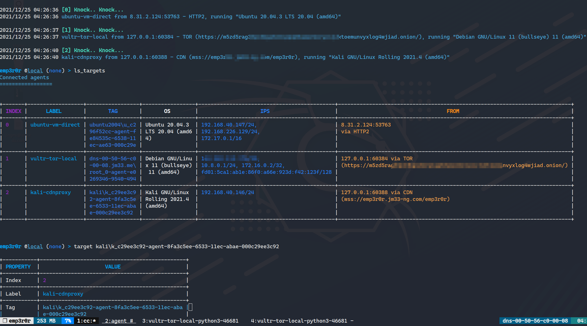

# emp3r0r

A post-exploitation framework for Linux/Windows

## Status

- emp3r0r C2 (Linux/Windows) is ready for testing. Please report bugs if you find any.
- Read [wiki](https://github.com/jm33-m0/emp3r0r/wiki) to get started
- Download from [here](https://github.com/jm33-m0/emp3r0r/releases)
- [Write modules](https://github.com/jm33-m0/emp3r0r/wiki/Write-modules-for-emp3r0r) for emp3r0r with your favorite languages
- [SSH harvester](https://github.com/jm33-m0/emp3r0r/blob/master/core/lib/agent/ssh_harvester_amd64_linux.go) is ready for use
- Windows support is ready with fully-interactive shell

https://github.com/jm33-m0/emp3r0r/assets/10167884/c7532c4d-8a6f-4a91-b52c-d7df4c80ba63

 MORE screenshots

<!-- https://user-images.githubusercontent.com/10167884/155106403-ca6bd763-7f09-4aae-adc3-67f7a36f99ad.mp4 -->

---

## Motivation

Initially, emp3r0r was developed as one of my weaponizing experiments. It was a learning process for me trying to implement common Linux adversary techniques and some of my original ideas.

**So, what makes emp3r0r different?** First of all, it is the first C2 framework that targets Linux platform including the capability of using any other tools through it. Take a look at the [features](#features) for more valid reasons to use it.

To support third-party modules, emp3r0r has complete [python3 support](https://github.com/jm33-m0/emp3r0r/wiki/Write-modules-for-emp3r0r#python), included in [`vaccine`](./core/modules/vaccine) module, 15MB in total, with necessary third party packages such as `Impacket`, `Requests` and `MySQL`.

---

## Features

- Beautiful Terminal UI
  - Use [tmux](https://github.com/tmux/tmux) for window management
- Stealth
  - Automatically changes `argv` so you won't notice it in `ps` listing
  - Hide files and PIDs via Glibc hijacking (`patcher` in `get_persistence`)
  - Built-in [**Elvish Shell**](https://elv.sh/) with the same disguise as main process
  - All C2 communications made in HTTP2/TLS
  - Defeat [**JA3**](https://github.com/salesforce/ja3) fingerprinting with [**UTLS**](https://github.com/refraction-networking/utls)
  - Painlessly encapsulated in **Shadowsocks** and KCP
  - Able to encapsulate in any external proxies such as [**TOR** and **CDN**s](https://github.com/jm33-m0/emp3r0r/raw/master/img/c2transports.png)
  - [**C2 relaying**](https://github.com/jm33-m0/emp3r0r/wiki/C2-Relay) via SSH
  - [**DLL agent**](https://github.com/jm33-m0/emp3r0r/wiki/DLL-Agent)
- Multi-Tasking
  - Don't have to wait for any commands to finish
- Module Support
  - Provides [**python3** environment](https://github.com/jm33-m0/emp3r0r/releases/tag/v1.3.10) that can easily run your exploits/tools on any Linux host
  - [Custom Modules](https://github.com/jm33-m0/emp3r0r/wiki/Write-modules-for-emp3r0r)
- Perfect Shell Experience via **SSH with PTY support**
  - Compatible with any SSH client and **available for Windows**
- [Bettercap](https://github.com/bettercap/bettercap)
- Auto persistence via various methods
- [Post-exploitation Tools](https://github.com/jm33-m0/emp3r0r/tree/master/core/modules/vaccine)
  - Nmap, Socat, Ncat, Bettercap, etc
- Credential Harvesting
  - [**OpenSSH password harvester**](https://github.com/jm33-m0/emp3r0r/blob/master/core/lib/agent/ssh_harvester_amd64_linux.go)
- [Process Injection](https://jm33.me/emp3r0r-injection.html)
- [Shellcode Injection](https://jm33.me/process-injection-on-linux.html)
- ELF Patcher for persistence
- [Packer](https://github.com/jm33-m0/emp3r0r/tree/master/packer)
  - Encrypts and compresses agent binary and runs agent in a covert way
- Hide processes and files and get persistence via shared library injection
- Networking
  - Port Mapping
    - From C2 side to agent side, and vice versa
    - TCP/UDP both supported
  - Agent Side Socks5 Proxy with UDP support
- [Auto Root](https://github.com/jm33-m0/go-lpe)
- LPE Suggest
- System Info Collect
- File Management
  - Enables **resumable downloads/uploads**
  - SFTP support: browse remote files with any SFTP client, [including your local **GUI file manager**](https://github.com/jm33-m0/emp3r0r/releases/tag/v1.22.3)
- Log Cleaner
- Screenshot
- Anti-Antivirus
- Internet Access Checker
- Automatically bridge agents from internal networks to C2
  - For semi-isolated networks
- Proxy via agent to agent SSH connection
  - To [bring any targets you can reach to C2](https://github.com/jm33-m0/emp3r0r/wiki/Getting-started#bring-agents-to-c2)
- [Interoperability with Metasploit/Cobalt Strike](https://github.com/jm33-m0/emp3r0r/wiki/Interoperability-with-metasploit-and-other-C2-frameworks)
- and many more :)
