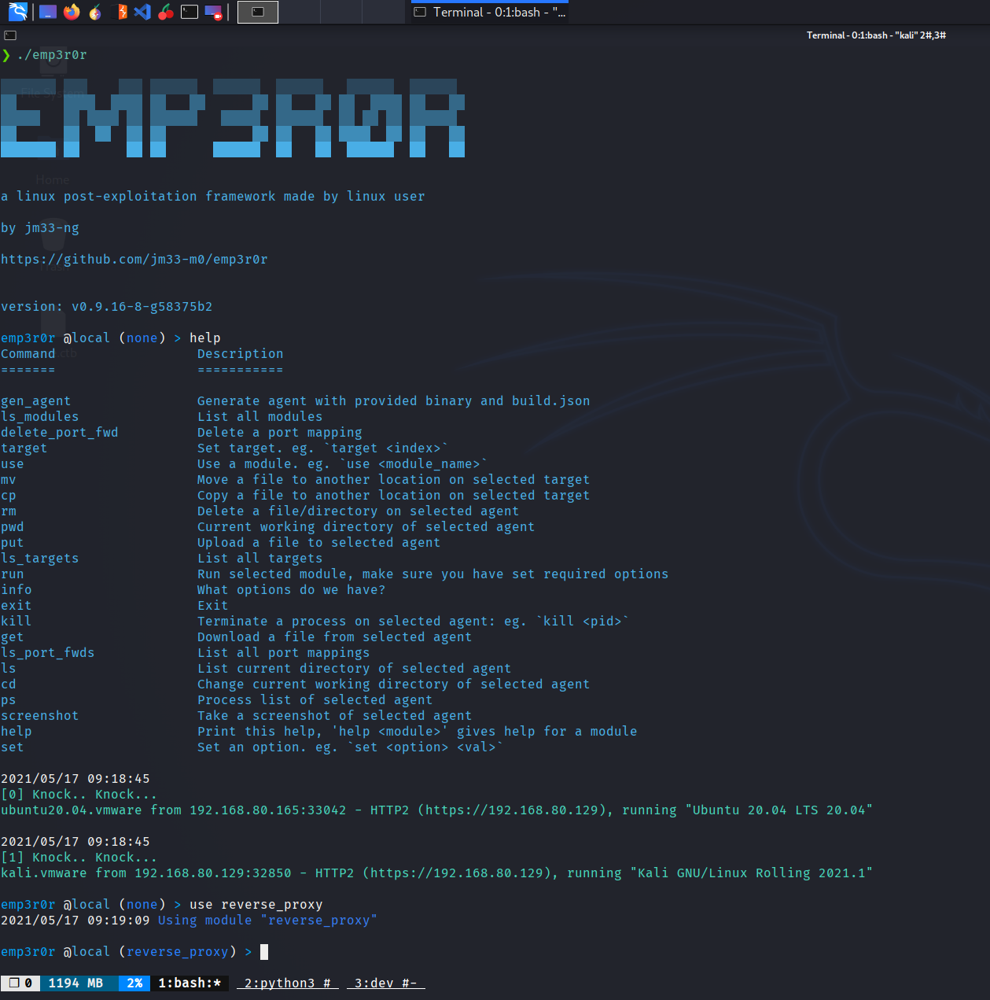
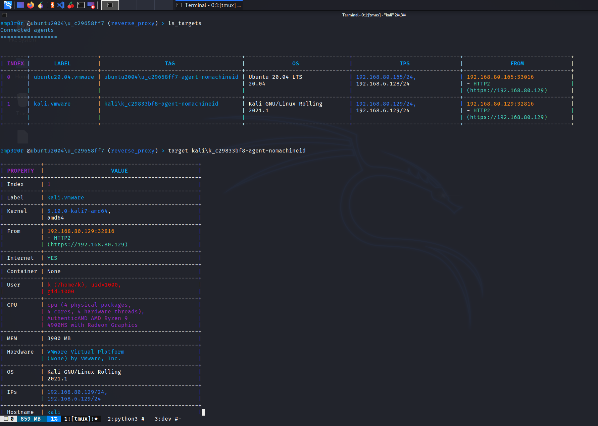

# emp3r0r
linux post-exploitation framework made by linux user

**Still under active development**

- [features](./FEATURES.md)
- [中文介绍](https://www.freebuf.com/sectool/259079.html)
- [check my blog for updates](https://jm33.me/emp3r0r-0x00.html)
- [how to use](https://github.com/jm33-m0/emp3r0r/wiki)
- **collaborators wanted!!!** please [contact me](https://jm33.me/pages/got-something-to-say.html) if you are interested
- **cross-platform** support is in progress, contribute if you want emp3r0r to run on other systems
- feel free to develop your **private version** of emp3r0r, and i would appreciate that you contribute back to this branch

----------

## table of contents

<!-- vim-markdown-toc GFM -->

* [glance](#glance)
* [what to expect (in future releases)](#what-to-expect-in-future-releases)

<!-- vim-markdown-toc -->

## glance

## what to expect (in future releases)

- [x] packer: cryptor + `memfd_create`
- [x] packer: use `shm_open` in older Linux kernels
- [x] dropper: shellcode injector - python
- [x] port mapping: forward from CC to agents, so you can use encapsulate other tools (such as Cobalt Strike) in emp3r0r's CC tunnel
- [x] randomize everything that can be randomized (file path, port number, etc)
- [x] injector: shellcode loader, using python2
- [x] injector: inject shellcode into arbitrary process, using go and ptrace syscall
- [x] injector: recover process after injection
- [x] persistence: inject guardian shellcode into arbitrary process to gain persistence
- [x] **headless CC**, control using existing commands, can be useful when we write a web-based GUI
- [x] screenshot, supports both windows and linux
- [x] reverse proxy
- [x] better file manager
- [x] resumable download/upload
- [x] screenshot
- [x] **better shells!**
- [ ] network scanner
- [ ] passive scanner, for host/service discovery
- [ ] password spray
- [ ] auto pwn using weak credentials and RCEs
