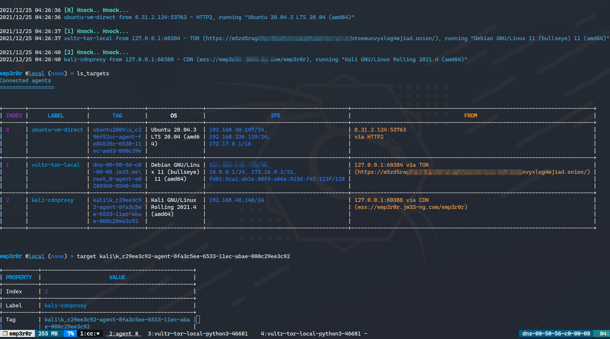

# 📸 Screenshots and Video Demos

**Visual guide to emp3r0r's capabilities and features**

_Note: emp3r0r is under active development and features might change_

---

## 🎬 Video Demonstrations

### SSH Harvester Module

https://github.com/user-attachments/assets/e735b325-d9ad-43bd-b34d-79f395cc4b8f

---

## 📷 Screenshots

### Interface and Setup

### Agent Management

### Features Overview

### C2 Transport Methods

